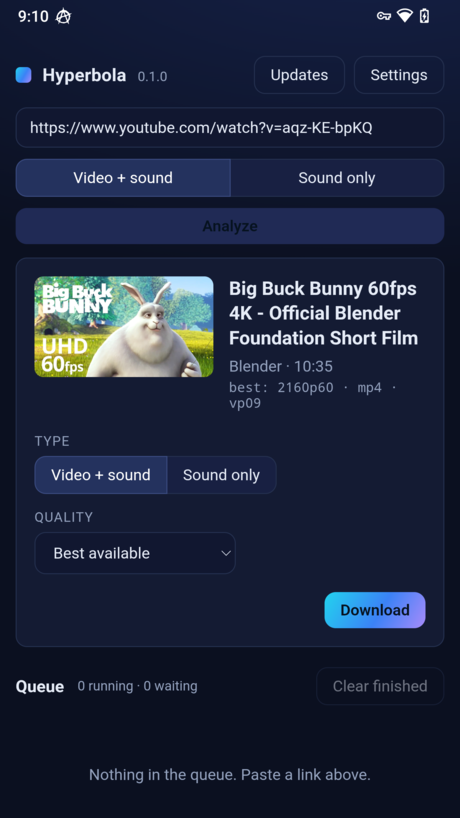
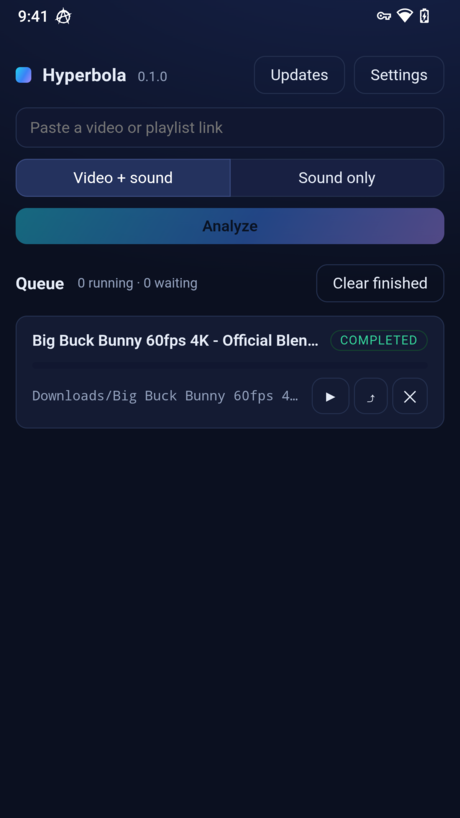
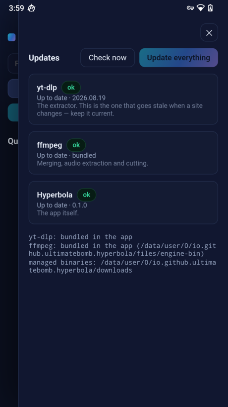

# Hyperbola

[](https://github.com/UltimateBomb/hyperbola/actions/workflows/ci.yml)
[](https://github.com/UltimateBomb/hyperbola/actions/workflows/release.yml)
[](LICENSE)
[](#download)
[](https://github.com/UltimateBomb/hyperbola/releases/latest)

**Download video and audio from hundreds of sites — on a PC and on a phone, from one engine.**

Paste a link, pick video or sound, press download. The app keeps itself,
yt-dlp and ffmpeg current on its own, so it does not quietly rot the way a
downloader does when a site changes.

🇷🇺 [Читать по-русски](README.ru.md)

---

## Download

| You have | Take this | Size |
|---|---|---|
| **Windows** 10 or 11 | [`Hyperbola_0.1.1_x64-setup.exe`](https://github.com/UltimateBomb/hyperbola/releases/latest) | 3 MB |
| **Android phone** (almost any since 2015) | [`app-arm64-release.apk`](https://github.com/UltimateBomb/hyperbola/releases/latest) | 60 MB |
| Older or 32-bit Android | `app-arm-release.apk` | 53 MB |
| Android emulator / x86 tablet | `app-x86_64-release.apk` | 63 MB |

**[→ All files on the releases page](https://github.com/UltimateBomb/hyperbola/releases/latest)**

*Windows:* run the installer. Everything else — yt-dlp, ffmpeg — the app
fetches by itself on first launch.

*Android:* open the APK and allow the install. The whole engine is inside the
package: nothing to set up, works without Google Play. If the phone is not
from the last decade and you are unsure, take `app-arm64-release.apk` — that
is nearly every phone.

## What it looks like

<p align="center">
  
  
  
</p>

## What it does

- **Video with sound, or sound only** — chosen before you paste, not after.
- **Formats that actually play.** YouTube now serves AV1 and Opus as "best",
  and a phone more than a few years old decodes neither: the file downloads
  perfectly and will not play. H.264 and AAC come first here, with a switch
  for anyone who wants the newer codecs.
- **One update centre** for the app, yt-dlp and ffmpeg — with one button. A
  failed check says so; it never quietly reads as "up to date".
- **A queue that survives.** Close the app mid-download and it comes back
  paused with the partial file intact.
- **Playlists** listed in about a second, with the items you want ticked.
- **On a phone:** downloads keep running with the screen off, finished files
  land in the folder you granted, and one button hands a file to Bluetooth,
  a messenger — or serves it over Wi-Fi, which is how you get a film onto a
  car head unit in half a minute instead of forty.

## How it is built

**The engine knows no platform. The shells know no rules.**

`hyperbola-core` builds yt-dlp command lines, reads its output, runs the queue
and decides what is out of date. It performs no I/O at all — no processes, no
sockets, no files. Everything platform-specific lives in a shell:

- **Windows** spawns `yt-dlp.exe` and keeps it and ffmpeg current itself.
- **Android** cannot execute a downloaded binary at all, so the engine —
  yt-dlp, Python, ffmpeg, QuickJS — ships inside the APK and updates its own
  extractor from the same release feed the desktop reads.

That is why the two are one product rather than two lookalikes: a rule fixed
in the engine is fixed on both, in the same release, with the same tests
behind it.

More in [ARCHITECTURE.md](ARCHITECTURE.md) · Android specifics in
[docs/ANDROID.md](docs/ANDROID.md) · the signing key in
[docs/SIGNING.md](docs/SIGNING.md).

## Building it yourself

```bash
cargo test                       # the engine and the runner
npm ci && npm --prefix ui ci
npm run build                    # the desktop app
```

Without a window, for a machine you can only reach over a shell:

```bash
cargo run -p hyperbola-cli -- probe <url>
cargo run -p hyperbola-cli -- get <url> --max-height 1080 --out ~/Downloads
```

Android needs a JDK, the Android SDK and the NDK:

```bash
npx tauri android init && node scripts/android-prepare.mjs
npx tauri android build --apk --split-per-abi
```

## Where it comes from

Two projects shaped it, and neither is forked here — no code is copied from
either:

- **[Parabolic](https://github.com/NickvisionApps/Parabolic)** (MIT) — the
  idea of a platform-independent core with thin shells, and the depth of its
  yt-dlp coverage.
- **[Open Video Downloader](https://github.com/StefanLobbenmeier/youtube-dl-gui)**
  (AGPL-3.0) — keeping yt-dlp *and* ffmpeg current at runtime instead of
  freezing them at install time.

The downloading itself is [yt-dlp](https://github.com/yt-dlp/yt-dlp); the
merging and audio extraction are [ffmpeg](https://ffmpeg.org/). On Android
both arrive through
[youtubedl-android](https://github.com/yausername/youtubedl-android).

## Licence

GPL-3.0-or-later — the app ships ffmpeg alongside it.

Videos on YouTube and other sites may be protected by copyright. This tool
does not endorse, and its authors are not responsible for, use that breaks
those laws.
